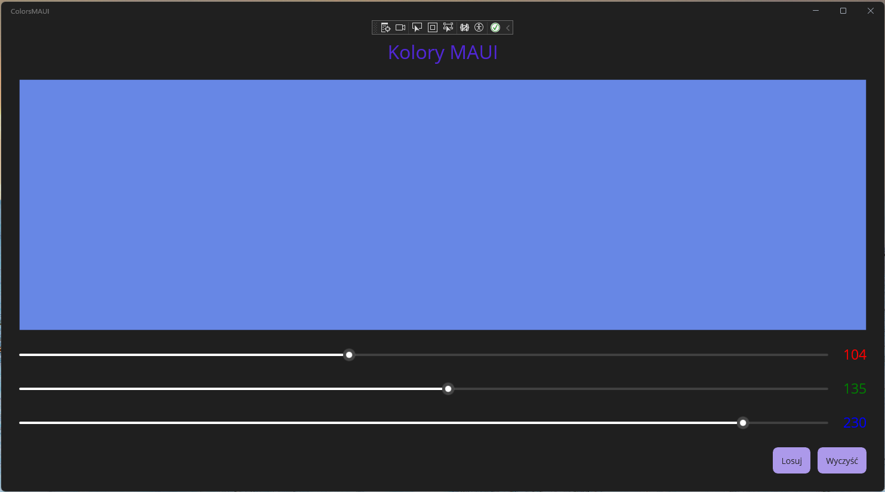
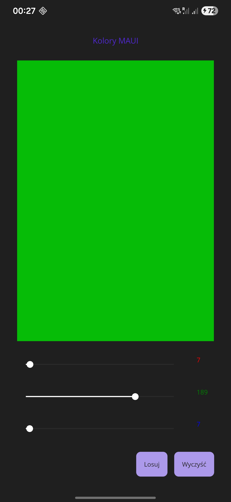

# Task 08 - Wprowadzenie do .NET MAUI
Twoim zadaniem jest przygotowanie aplikacji, umożliwiającej zmianę koloru prostokąta przy użyciu suwaków.



## Wprowadzenie teoretyczne - czym jest .NET MAUI i XAML?

### Czym jest .NET MAUI?

**.NET MAUI (Multi-platform App UI)** to technologia firmy Microsoft umożliwiająca tworzenie **jednej aplikacji**, która może być uruchamiana na wielu platformach:
- Windows
- Android
- iOS
- macOS

Najważniejszą ideą MAUI jest:
> **jeden projekt → wiele platform**

Mimo że kod źródłowy jest wspólny, aplikacja jest **kompilowana osobno dla każdej platformy**. Dzięki temu:
- zachowuje natywną wydajność,
- korzysta z natywnych kontrolek systemowych,
- może reagować na różnice między platformami (np. Android vs iOS).

### Architektura aplikacji MAUI

Projekt MAUI składa się z kilku kluczowych elementów:
- **XAML** - opis interfejsu użytkownika (UI),
- **C#** - logika aplikacji (zachowanie, reakcje na zdarzenia),
- **Platforms/** - kod specyficzny dla danej platformy,
- **Resources/** - zasoby wspólne (kolory, style, obrazy).

W tym zadaniu korzystamy z najprostszego modelu:
- XAML + code-behind (bez MVVM).

## Czym jest XAML?

### XAML - język opisu interfejsu

**XAML (eXtensible Application Markup Language)** to język znaczników służący do **deklaratywnego opisywania interfejsu użytkownika**.

Deklaratywny oznacza, że:
- opisujemy *co* ma się pojawić,
- a nie *jak* to stworzyć krok po kroku w kodzie.

Przykład:
```xml
<Slider />
```
Oznacza:
> „W tym miejscu interfejsu ma znajdować się suwak”.

Nie musimy ręcznie tworzyć obiektu, ustawiać pozycji ani rozmiaru - robi to framework.

---

### Dlaczego oddzielamy XAML od C#?

Rozdzielenie interfejsu (XAML) i logiki (C#) daje:
- **czytelność kodu**,
- łatwiejsze zmiany wyglądu bez ingerencji w logikę,
- możliwość pracy zespołowej (np. grafik + programista),
- przygotowanie gruntu pod wzorzec **MVVM**.

W tym ćwiczeniu korzystamy z prostszego podejścia (*code-behind*), które:
- jest łatwiejsze na start,
- pozwala zrozumieć zależności między UI a kodem.

---

### ContentPage - strona aplikacji

Każdy plik XAML w MAUI opisuje zwykle jedną **stronę aplikacji**.

```xml
<ContentPage>
</ContentPage>
```

- `ContentPage` to kontener najwyższego poziomu,
- odpowiada jednemu ekranowi aplikacji,
- wewnątrz może zawierać **dokładnie jeden element główny** (np. Grid).

---

### Namespace i atrybut x:Class

```xml
xmlns="http://schemas.microsoft.com/dotnet/2021/maui"
xmlns:x="http://schemas.microsoft.com/winfx/2009/xaml"
x:Class="KoloryMAUI.MainPage"
```

- `xmlns` - określa, skąd pochodzą kontrolki (odpowiednik `using` w C#),
- `xmlns:x` - przestrzeń nazw XAML (np. `x:Name`),
- `x:Class` - **łączy plik XAML z klasą C#**.

To właśnie dzięki `x:Class` plik `MainPage.xaml.cs` „widzi” elementy z XAML.

---

### x:Name - most między XAML a C#

```xml
<Slider x:Name="sliderR" />
```

- `x:Name` tworzy **pole w klasie C#**,
- pozwala odczytywać i modyfikować kontrolkę w code-behind,
- bez `x:Name` element istnieje tylko wizualnie.

---

## Cel zadania
Celem ćwiczenia jest:
- zapoznanie się ze strukturą projektu **.NET MAUI**,
- poznanie podstaw języka **XAML** (Grid, Slider, Rectangle, Label),
- obsługa **zdarzeń** w MAUI (ValueChanged),
- połączenie warstwy XAML z kodem C# (code-behind),
- uruchomienie aplikacji na **Windows** oraz (opcjonalnie) **Android Emulator**.

Efektem końcowym będzie aplikacja, w której trzy suwaki sterują składowymi **RGB** koloru prostokąta.

---

## Wymagania wstępne
- Visual Studio 2022
- Zainstalowane workloady:
  - **.NET Multi-platform App UI development**
  - (opcjonalnie) **Android SDK / Emulator**
- System Windows 10/11

---

## Część 1 - Utworzenie projektu

1. Uruchom **Visual Studio 2022**.
2. Wybierz **Create a new project**.
3. Wyszukaj i wybierz szablon **.NET MAUI App**.
4. Nazwij projekt: `KoloryMAUI`.
5. Zatwierdź ustawienia (domyślne są wystarczające).

Po utworzeniu projektu uruchom aplikację na **Windows Machine** (F5).

✔️ Powinna pojawić się domyślna aplikacja MAUI z przyciskiem i napisem *Hello, World!*.

---

## Część 2 - Projektowanie interfejsu (XAML)

### 2.1 Usunięcie domyślnego układu

1. Otwórz plik `MainPage.xaml`.
2. Usuń zawartość elementu `ScrollView`.
3. Wstaw poniższy kod:

```xml
<ContentPage xmlns="http://schemas.microsoft.com/dotnet/2021/maui"
             xmlns:x="http://schemas.microsoft.com/winfx/2009/xaml"
             x:Class="KoloryMAUI.MainPage">

    <Grid RowSpacing="25" Padding="30"
          RowDefinitions="300,Auto,Auto,Auto">
        <Rectangle Grid.Row="0" Fill="Black" />
        <Slider Grid.Row="1" />
        <Slider Grid.Row="2" />
        <Slider Grid.Row="3" />
    </Grid>

</ContentPage>
```

### Grid - dlaczego używamy siatki?

`Grid` to jeden z najważniejszych kontenerów układu w MAUI.

Dlaczego Grid:
- umożliwia precyzyjne rozmieszczenie elementów,
- dobrze skaluje się na różnych rozmiarach ekranów,
- jest bardziej elastyczny niż `StackLayout`.

```xml
<Grid RowDefinitions="*,Auto,Auto,Auto">
```

Znaczenie:
- `*` - zajmuje **całą dostępną przestrzeń**,
- `Auto` - dopasowuje się do zawartości.

Dlatego prostokąt:
- rośnie i maleje razem z oknem,
- a suwaki zachowują stałą wysokość.

⚠️ Projekt chwilowo może się **nie kompilować** - to normalne.

---

## Część 3 - Nazwy kontrolek

Aby móc sterować elementami z poziomu C#, nadajemy im nazwy.

Zmień kod `Grid` na:

```xml
<Grid RowSpacing="25" Padding="30"
      RowDefinitions="300,Auto,Auto,Auto">

    <Rectangle x:Name="rectangle" Grid.Row="0" Fill="Black" />
    <Slider x:Name="sliderR" Grid.Row="1" />
    <Slider x:Name="sliderG" Grid.Row="2" />
    <Slider x:Name="sliderB" Grid.Row="3" />

</Grid>
```

### Rectangle, Slider i Label - rola kontrolek

#### Rectangle
- służy do wizualizacji koloru,
- właściwość `Fill` określa wypełnienie,
- kolor ustawiany jest **pędzlem (Brush)**, a nie bezpośrednio kolorem.

#### Slider
- kontrolka wejściowa,
- wartość typu `double`,
- domyślny zakres: `0.0 - 1.0` (idealny do RGB w MAUI).

#### Label
- kontrolka wyświetlająca tekst,
- w tym ćwiczeniu pokazuje wartości RGB,
- kolor tekstu odpowiada kanałowi koloru.

---

## Część 4 - Obsługa zdarzeń

### 4.1 Powiązanie zdarzenia ValueChanged

Dodaj obsługę zdarzeń do wszystkich suwaków:

```xml
<Slider x:Name="sliderR" Grid.Row="1" ValueChanged="sliderR_ValueChanged" />
<Slider x:Name="sliderG" Grid.Row="2" ValueChanged="sliderR_ValueChanged" />
<Slider x:Name="sliderB" Grid.Row="3" ValueChanged="sliderR_ValueChanged" />
```

### Zdarzenia - jak aplikacja reaguje na użytkownika?

MAUI jest frameworkiem **zdarzeniowym**.

```xml
ValueChanged="sliderR_ValueChanged"
```

Oznacza:
> „Gdy użytkownik poruszy suwakiem, wywołaj tę metodę”.

Zamiast ciągłego sprawdzania stanu (jak w pętli), aplikacja:
- **czeka na zdarzenie**,
- reaguje tylko wtedy, gdy coś się wydarzy.

### 4.2 Kod C# - pierwsza reakcja

Otwórz `MainPage.xaml.cs` i dodaj metodę:

```csharp
private void sliderR_ValueChanged(object sender, ValueChangedEventArgs e)
{
    rectangle.Fill = Brush.Firebrick;
}
```

Uruchom aplikację i porusz dowolnym suwakiem.

✔️ Prostokąt powinien zmienić kolor.

---

## Część 5 - Sterowanie kolorem RGB

Zmień metodę na:

```csharp
private void sliderR_ValueChanged(object sender, ValueChangedEventArgs e)
{
    Color color = Color.FromRgb(
        sliderR.Value,
        sliderG.Value,
        sliderB.Value);

    rectangle.Fill = new SolidColorBrush(color);
}
```

> **Podpowiedź**
>
> Nie musisz kopiować tego kodu do każdej metody obsługującej zdarzenie `ValueChanged`, zamiast tego masz dwie opcje:
> - Podpiąć wszystkie slidery do jednej metody obsługującej zdarzenie `ValueChanged`
> - Dodać metodę, która będzie aktualizowała kolor prostokąta, i tylko ją wywoływać z metod obsługujących `ValueChanged`.

✔️ Teraz kolor prostokąta zależy od trzech suwaków.

### Color i SolidColorBrush - dlaczego tak?

```csharp
Color color = Color.FromRgb(...);
rectangle.Fill = new SolidColorBrush(color);
```

Dlaczego nie ustawiamy koloru bezpośrednio?
- MAUI używa **pędzli** (Brush),
- pędzel może być jednolity, gradientowy lub obrazkowy,
- to rozwiązanie jest bardziej elastyczne i rozszerzalne.

### Dlaczego wartości Slider są typu double?

- MAUI jest projektowane z myślą o grafice i skalowaniu,
- wartości zmiennoprzecinkowe pozwalają na płynne animacje,
- przeskalowanie do zakresu 0-255 robimy **dopiero na potrzeby wyświetlania**.

## Część 6 - Uelastycznienie układu

Zmień definicję wierszy na:

```xml
RowDefinitions="*,Auto,Auto,Auto"
```

Usuń `ScrollView`, aby Grid mógł zajmować cały ekran.

✔️ Interfejs dopasowuje się do rozmiaru okna.

## Część 7 - Etykiety RGB

Dodaj kolumnę i etykiety - `ColumnDefinitions` jako atrybut w `Grid`:

```xml
<Grid RowSpacing="25" Padding="30"
      RowDefinitions="*,Auto,Auto,Auto"
      ColumnDefinitions="*,Auto"
      ColumnSpacing="25">

    <Rectangle x:Name="rectangle" Grid.Row="0" Grid.ColumnSpan="2" Fill="Black" />

    <Slider x:Name="sliderR" Grid.Row="1" ValueChanged="sliderR_ValueChanged" />
    <Label x:Name="labelR" Grid.Row="1" Grid.Column="1"
           Text="0" TextColor="Red" FontSize="Medium" />

    <Slider x:Name="sliderG" Grid.Row="2" ValueChanged="sliderR_ValueChanged" />
    <Label x:Name="labelG" Grid.Row="2" Grid.Column="1"
           Text="0" TextColor="Green" FontSize="Medium" />

    <Slider x:Name="sliderB" Grid.Row="3" ValueChanged="sliderR_ValueChanged" />
    <Label x:Name="labelB" Grid.Row="3" Grid.Column="1"
           Text="0" TextColor="Blue" FontSize="Medium" />

</Grid>
```

I uzupełnij kod C#:

```csharp
labelR.Text = Math.Round(255 * color.Red).ToString();
labelG.Text = Math.Round(255 * color.Green).ToString();
labelB.Text = Math.Round(255 * color.Blue).ToString();
```

> **Podpowiedź**
>
> Postaraj się zrobić to bardziej optymalnie, aby nie aktualizować wszystkich etykiet, kiedy zmieniła się wartość tylko jednego slidera.

### Code-behind - dlaczego jeszcze go używamy?

Choć w profesjonalnych aplikacjach stosuje się wzorzec projektowy **MVVM**,
na tym etapie nauki:
- code-behind jest prostszy,
- pozwala szybciej zobaczyć efekt,
- ułatwia zrozumienie zależności UI ↔ logika.

W kolejnych lekcjach to podejście zostanie zastąpione MVVM.

## Zadania do wykonania


1. Dodaj przycisk **Reset**, który ustawia kolor na czarny - *resetuje display, slidery i labele.*
2. Jeżeli stan aplikacji jest zresetowany, przycisk **Reset** powinien być wyszarzony i nieaktywny.
3. Dodaj przycisk **Wylosuj kolor**, który ustawi losowy kolor display - *odzwierciedlony w pozycji sliderów i widoczny na labelach.*

**Zadanie na ocenę celującą:**
Dodaj do aplikacji możliwość zapisania i odtwarzania stanu aplikacji po jej zamknięciu i uruchomieniu ponownie. W tym celu nadpisz metodę `OnDisappearing`, należącą do klasy `ContentPage`. Ustawienia przechowuj w pliku tekstowym - plain text lub json.


