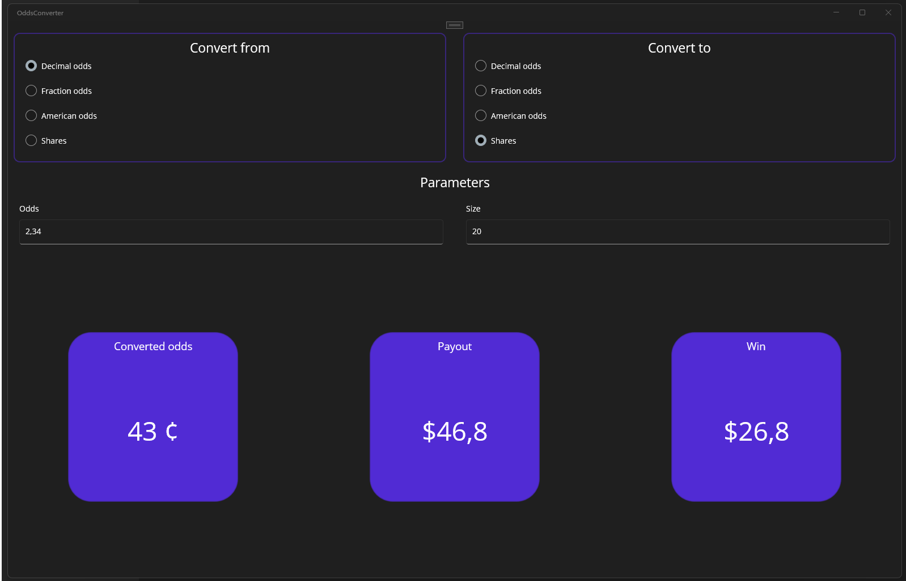
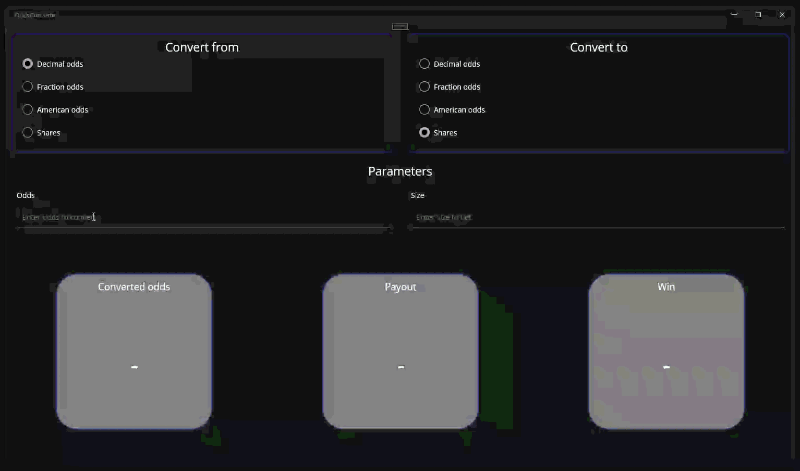

# Task 12 - Konwerter kursów
Konwertowanie różnych notacji kursów na inne, przy użyciu konwerterów w .NET MAUI.


## Wymagania
Twoja aplikacja powinna posiadać następujące funkcjonalności:
- Poprawnie przeliczać kursy:
    - decimal odds,
    - fraction odds,
    - american *(moneyline)* odds,
    - shares *(price as probability / binary market notation)*.
- Wyświetlać poprawnie przeliczone wartości, w tym:
    - przekonwertowany kurs, na wybraną notację *(z odpowiednim formatowaniem)*,
    - wyświetlać możliwą wypłatę *(payout)*,
    - wyświetlać możliwą wygraną *(win)*.
- Uniemożliwiać użytkownikowi przeliczenie kursu z tej samej notacji
    - *jeżeli użytkownik w jednym z formularzy ma zaznaczone `decimal odds` nie powinien móc ich zaznaczyć w drugim formularzu - wtedy program powinien odwrócić zaznaczenie.*
- Program powinien na żywo wszystko przeliczać, po zmianie zaznaczenia `<RadioButton />`, po każdej zmianie w polu `Odds` i `Size`. **Nie powinno być żadnego przycisku typu *"Oblicz"***.
- Jeżeli przeliczenie danej wartości jest niemożliwe z jakiegoś powodu *(np. błędne dane)*, w kwadracie na dole powinna wyświetlić się stosowna informacja, przykładowo `-`.

**Uwaga:** aby aplikacja mogła zostać poddana ocenie, musi prawidłowo implementować wzorzec **MVVM**.

## Krok po kroku
Spróbujmy stworzyć aplikację responsywną, z eleganckim i czystym kodem. ✅

### Kursy bukmacherskie - wprowadzenie teoretyczne.
W zależności od regionu oraz rynku *(Betfair, William Hill, Polymarket, itd.)* serwisy hazardowe posługują się różną notacją kursów:
- **decimal odds** - najbardziej popularne, i najłatwiejsze do zrozumienia. Zapisuje się je w formacie: `2,02`, `1,454`, `2,00`.
    - Określają one całkowity zwrot *(stawka + wygrana)*. Przykładowo `2,00` oznacza podwojenie postawionej kwoty. Czasami nazywa się je również *european odds*.
- **fraction odds** - stosowane głównie w Wielkiej Brytanii i Irlandii. Zapisywane są w formie ułamka, np. `3/1`, `5/2`, `10/11`.
    - Określają stosunek zysku do stawki. Przykładowo kurs `3/1` oznacza, że za każdą postawioną jednostkę wygrywamy trzy jednostki *(plus zwrot stawki)*.
- **american odds *(moneyline)*** - popularne w Stanach Zjednoczonych, zapisywane jako liczby dodatnie lub ujemne, np. `+200`, `-150`.
    - Wartości dodatnie określają zysk przy stawce 100 *(np. +200 to wygrana 200)*, natomiast wartości ujemne wskazują, ile należy postawić, aby wygrać 100 *(np. -150 trzeba postawić 150, aby wygrać 100)*.
- **shares *(price as probability)*** - stosowane przez rynki predykcyjne. Zamiast klasycznych kursów użytkownik kupuje udziały *(shares)* w danym wyniku, których cena mieści się w zakresie od `0,00` do `1,00` *(implied probability)*. Kurs często jest zapisywany jako `36 ¢`, `99,8 ¢`.
    - Cena udziału bezpośrednio odpowiada **prawdopodobieństwu wystąpienia zdarzenia**. Przykładowo:
        - `36 ¢` = 36% szans, że coś się stanie,
        - `72 ¢` = 72% szans, że coś się stanie.
    - Każdy market predykcyjny składa się z dwóch przeciwnych opcji `Yes` i `No`, których ceny sumują się do `1.00`.
    - Jeżeli kupiłeś na dane zdarzenie akcję za `36 ¢`, w przypadku kiedy dane zdarzenie zajdzie, otrzymasz za tę akcję dokładnie `1 USDC` *(uzupełnienie do jeden, z zakładu strony przeciwnej)*.
    - **Ciekawostka**: określenie *prediction markets* wywodzi się z świata bankowego. Jest to taka komercyjna nazwa hazardu, żeby nie nazwać go hazardem. Podobnie jest z ubezpieczeniami - ubezpieczyciel zakłada się z Tobą, czy coś Ci się stanie *(polisa)*. Ta forma hazardu *(mimo, że dużo bardziej okrutna niż zakłady sportowe)* jest powszechnie akceptowana, i nikt nie widzi w tym nic złego.

#### Prawdopodobieństwo - na jego podstawie powstają kursy.
Istotą każdego rynku hazardowego jest **prawdopodobieństwo na zajście danego zdarzenia**. Przy zakładach zawsze mamy dwie strony:
- **makers** - wystawiają ofertę zakładu, z kursem określonym na podstawie własnych modeli, analiz statystycznych oraz marży *(tzw. **margin**, czyli przewagi bukmachera)*.
- **takers** - przyjmują ofertę, czyli zawierają zakład po zaproponowanym kursie, uznając go za korzystny.

Każdy kurs jest w rzeczywistości odwrotnością prawdopodobieństwa zdarzenia *(z uwzględnieniem marginu)*.

#### Wzory matematyczne
Poniżej znajdują się wzory matematyczne, na każdy typ kursu.

##### Kursy dziesiętne *(decimal odds)*

Przeliczanie na prawdopodobieństwo:

$$
P = \frac{1}{O_d}
$$

Przeliczanie na kurs:

$$
O_d = \frac{1}{P}
$$

gdzie:
- **P** – prawdopodobieństwo
- **Od** – kurs dziesiętny

---

##### Kursy amerykańskie *(american odds)*

Przeliczanie na prawdopodobieństwo

$$
P =
\begin{cases}
\frac{100}{O_a + 100} & \text{dla } O_a > 0 \\
\frac{-O_a}{-O_a + 100} & \text{dla } O_a < 0
\end{cases}
$$

Przeliczenie na kurs:

$$
O_a =
\begin{cases}
100 \cdot \frac{1 - P}{P} & \text{dla } P < 0.5 \\
-100 \cdot \frac{P}{1 - P} & \text{dla } P \geq 0.5
\end{cases}
$$

gdzie:
- **Oa** – kurs amerykański

---

##### Kursy ułamkowe *(fractional odds)*

$$
P = \frac{d}{n + d}
$$

$$
O_f = \frac{n}{d}
$$

Przeliczenie z prawdopodobieństwa:

$$
O_f = \frac{1}{P} - 1
$$

gdzie:
- **Of** - kurs ułamkowy
- **n** – licznik
- **d** – mianownik

> **Uwaga**
>
> W praktyce kursy ułamkowe powinny być zapisane w **najprostszej postaci**, czyli jako ułamek nieskracalny.

Po przeliczeniu z prawdopodobieństwa:

$$
O_f = \frac{1}{P} - 1
$$
 
otrzymujemy liczbę rzeczywistą, którą należy zamienić na ułamek:
 
$$
O_f \approx \frac{n}{d}
$$
 
W tym celu stosuje się aproksymację *(np. poprzez skalowanie do wybranej precyzji)*, a następnie skracanie ułamka:
 
$$
n' = \frac{n}{\gcd(n, d)}, \quad d' = \frac{d}{\gcd(n, d)}
$$
 
gdzie:
- $\gcd(n, d)$ – największy wspólny dzielnik *(Greatest Common Divisor)*
 
Dzięki temu uzyskujemy poprawny zapis kursu, np.:
 
$$
\frac{500}{1000} = \frac{1}{2}
$$

**Przykładowy kod:**
```csharp
public static (double Numerator, double Denominator) ProbabilityToFractionalOdds(double probability)
{
    var decimalOdds = ProbabilityToDecimalOdds(probability);
    var fractional = decimalOdds - 1.0;

    // Aproksymacja ułamka do najbliższej liczby całkowitej
    const int PRECISION = 1000; // Im większa, tym wynik będzie dokładniejszy

    var numerator = (int)Math.Round(fractional * PRECISION);
    var denominator = PRECISION;

    // Skracanie ułamka
    var gcd = GreatestCommonDivisor(numerator, denominator);
    return (numerator / gcd, denominator / gcd);
}
```
 
---

##### Shares *(prediction markets, np. Polymarket)*

$$
P = \frac{S}{100}
$$

$$
S = P \cdot 100
$$

gdzie:
- **S** – liczba shares (0–100)

---

**Wszystkie formaty kursów** są różnymi reprezentacjami tej samej wartości - **prawdopodobieństwa**.

### Struktura projektu
Oprócz samego stosowania wzorca **MVVM** powinniśmy jeszcze ustalić kilka innych kwestii.

#### Kalkulator kursów.
Przeliczanie kursów, nie wymaga trzymania stanu - **obliczamy kurs, a następnie o tym zapominamy**. Jest to już pewna poszlaka, w jaki sposób powinniśmy zaimplementować kalkulator.

Najlepszym pomysłem będzie stworzenie **klasy statycznej**, która będzie odpowiedzialna za obliczenia.

```csharp
namespace OddsConverter.Calculators
{
    public static class OddsCalculator
    {
        #region Shares

        public static double SharesToProbability(double shares)
        {
            return shares / 100.0;
        }

        public static double ProbabilityToShares(double probability)
        {
            return probability * 100.0;
        }

        #endregion

        // [...]
    }
}
```

Dzięki temu, że nasz kalkulator jest klasą statyczną, możemy uzyskać dostęp do jego metod **z dowolnego miejsca w kodzie**, **bez konieczności tworzenia instancji** tej klasy.

#### Konwersja kursów w UI
Do konwertowania danych wprowadzonych przez użytkownika, użyjemy **konwerterów**. Do konwersji kursów, obliczania wypłaty oraz wygranej, najlepszą opcją będzie skorzystanie z **konwerterów wielowartościowych** - `IMultiValueConverter`.

```xml
<Label
    x:Name="payoutResultLabel"
    Grid.Row="1"
    StyleClass="resultText">
    <Label.Text>
        <MultiBinding Converter="{StaticResource PayoutConverter}" ConverterParameter="Payout">
            <Binding Path="InputNotation" />
            <Binding Path="Odds" />
            <Binding Path="Size" />
        </MultiBinding>
    </Label.Text>
</Label>
```

Jak możesz zauważyć, na powyższym kodzie nasz konwerter od razu uwzględnia **wartości z ViewModelu**, takie jak:
- `InputNotation` - enum z typem kursu,
- `Odds` - kurs,
- `Size` - postawiona stawka.

Konwerter może wyglądać mniej więcej tak:
```csharp
namespace OddsConverter.Converters
{
    public class PayoutConverter : OddsConverterBase, IMultiValueConverter
    {
        public object Convert(object[] values, Type targetType, object parameter, CultureInfo culture)
        {
            // Dobrze jest się zabezpieczyć, na wypadek źle podanych parametrów w XAML
            if (values.Length == 3 && values[0] is OddsNotation inputNotation && values[1] is string oddsText && values[2] is string sizeText && parameter is string outputType && !String.IsNullOrEmpty(outputType))
            {
                // Żeby nie tworzyć zbyt wielu konwerterów, można sobie uprościć zabawę poprzez sparametryzowanie takiego konwertera.
                if (outputType == "Payout")
                {
                    // [...]
                }

                if (outputType == "Win")
                {
                    // [...]
                }

                // Czy tutaj może zostać rzucony wyjątek?
            }

            // Zwracamy wartość, informującą użytkownika, że operacja się nie udała.
            return "-";
        }

        // Nie potrzebujemy obsługi konwersji w drugą stronę, więc zostawiamy NotImplementedException.
        public object[] ConvertBack(object value, Type[] targetTypes, object parameter, CultureInfo culture)
        {
            throw new NotImplementedException();
        }
    }
}
```

Zauważ, że obliczanie `Payout` oraz `Win` są bardzo podobne. Zamiast tworzyć dwa osobne konwertery, możemy po prostu jeden sparametryzować. Na powyższym przykładzie konwerter obsługuje dwie wartości tekstowe `Payout` oraz `Win`.

**Rozważ również możliwość skorzystania z klasy bazowej** dla konwerterów do konwersji kursu czy obliczeń wypłaty czy wygranej.
```csharp
namespace OddsConverter.Converters
{
    public abstract class OddsConverterBase
    {
        protected double ConvertToProbability(string inputOdds, OddsNotation inputNotation)
        {
            // Tutaj przyjmujemy input jako string, nasz kalkulator potrzebuje double oraz nie obsługuje enuma OddsNotation.
            // Uznajmy więc, że jest to metoda pomocnicza, która pomaga nam przekształcić każdy typ kursu na prawdopodobieństwo.
            if (inputNotation == OddsNotation.Fractional)
            {
                var parts = inputOdds.Split('/');
                if (parts.Length != 2)
                    throw new ArgumentException("Invalid fractional odds format."); // <-- zapobiegamy błędnym wynikom.

                // [...]
                return OddsCalculator.FractionalOddsToProbability(numerator, denominator);
            }

            // Kiedy przekonwertujemy nasz kurs na liczbę, możemy bez problemu odwołać się do kalkulatora.
            var odds = Double.Parse(inputOdds);
            return inputNotation switch
            {
                // [...]
            };
        }

        protected string ConvertToOutput(double probability, OddsNotation outputNotation)
        {
            // Tutaj próbujemy zwrócić końcową wartość jako string - już po formatowaniu.
            switch (outputNotation)
            {
                case OddsNotation.American:
                    return Math.Round(OddsCalculator.ProbabilityToAmericanOdds(probability), 1).ToString("+0.##;-0.##");

                // [...]
            }

            // Jeżeli tutaj doszliśmy, coś poszło nie tak. Co powinniśmy więc zwrócić? A może rzucić?
        }
    }
}
```

#### Wyświetlanie wartości
Aby wyświetlić wartości w takim samym stylu, jak na obrazku z początku instrukcji, możesz użyć kontrolki `<Border />`.

```xml
<Border Grid.Column="2" StyleClass="resultBorder">
    <!-- [...] -->
</Border>
```

Celem uzyskania ładnych zaokrąglonych rogów, możemy skorzystać ze styli:

```xml
<Style Class="resultBorder" TargetType="Border">
    <Setter Property="Stroke" Value="{StaticResource Primary}" />
    <Setter Property="StrokeShape" Value="RoundRectangle 40" />
    <!-- [...] -->
</Style>
```


## Wymagania
Poprawnie napisana aplikacja, powinna spełniać następujące wymagania:
- **Poprawnie implementować wzorzec MVVM**.
- Używać konwerterów do obsługi <RadioButton /> celem wyboru formatu kursów.
- Używać konwerterów do obsługi konwersji kursów oraz obliczania wypłaty i wygranej.
- Posiadać klasę statyczną z kalkulatorem, do przeliczania kursów.
- Dynamicznie reagować na wszystkie zmiany użytkownika.
- Poprawnie radzić sobie z źle wprowadzonymi danymi - nie chcemy komunikatów ani crashowania się aplikacji, chcemy wyświetlić stosowną informację w miejscu, gdzie wyświetlane są obliczane wartośc *(np. '-')*.
- Użytkownik nie może przeliczać tego samego typu kursu na ten sam typ. Jeżeli ma np. input - decimal, output - shares. Po wcisnięciu w input **shares** automatycznie w output **shares** powinno zmienić się na **decimal**.
- Pilnujmy poprawnego wyświetlania kursów:
    - decimal odds - max 3 miejsca po przecinku,
    - fractional odds - nic po przecinku,
    - american odds - max 1 miejsce po przecinku oraz znaki `+` *(jeżeli liczba dodatnia)* i `-` *(jeżeli liczba ujemna)*.
    - shares - max 1 miejsce po przecinku oraz znak `¢`.

## Wskazówki
Poniższe wskazówki, powinny pomóc Ci z realizacją tego zadania.
- **Wszystkie notacje kursów bazują na prawdopodobieństwie** - dobrym pomysłem będzie skorzystanie z prawdopodobieństwa jako kroku pomiędzy przeliczaniem różnych typów kursów.
- W momencie wprowadzania danych, przed wpisaniem pełnej wartości do pola, możemy mieć wartość nieobsługiwaną - zamiast sprawdzać wszystkie możliwe przypadki instrukcjami `if`, lepszym pomysłem może być **"przechwytywanie"** błędów, które wystąpią.



## Dane testowe
Poniżej znajdziesz dane, na których możesz testować swój algorytm.
| Fraction | Decimal | American (Moneyline) | Shares |
|----------|--------:|---------------------:|-------:|
| 1/100    | 1.01    | -10000               | 99 ¢   |
| 1/1      | 2.00    | +100                 | 50 ¢   |
| 15/8     | 2.88    | +187.5               | 34.8 ¢ |
| 2/1      | 3.00    | +200                 | 33.3 ¢ |
| 4/1      | 5.00    | +400                 | 20 ¢   |
| 1/2      | 1.50    | -200                 | 66.7 ¢ |
| 10/11    | 1.91    | -110                 | 52.4 ¢ |

## Kryteria oceny
Poniżej znajdziesz informację, jakie wymagania musi spełniać aplikacja celem zdobycia danej oceny.

#### Na ocenę dopusczającą
Aplikacja nie musi wyglądać ładnie, ale powinna implementować funkcjonalność przeliczania kursów oraz implementować pełen wzorzec MVVM. Przeliczanie kursów może odbywać się przez naciśnięcie przycisku.

> **Osoby objęte programem naprawczym:**
> - **dopuszczający**
>     - stworzenie pełnego i schludnego UI w XAML.
>     - stworzenie enumów.
>     - napisanie działającej klasy przeliczającej kursy.

#### Na ocenę bardzo dobrą
Aplikacja musi wyglądać ładnie i schludnie oraz musi implementować wszystkie funkcjonalności opisane w tej instrukcji.

#### Na ocenę celującą
Aplikacja dodatkowo powinna obsługiwać zmianę koloru kontenera, wewnątrz którego wyświetlane są przeliczone informacje. **Jeżeli wprowadzone dane są błędne, lub w ogóle nie zostały wprowadzone** kontener powinien przyjmować kolor szary.

##### Jak to zrobić?
Dobrym pomysłem będzie stworzenie zachowania, które będzie podpięte do kontenera, wewnątrz którego jest `<Label />`, który wyświetla wyniki obliczeń.
```xml
<Border Grid.Column="1" StyleClass="resultBorder">
    <Border.Behaviors>
        <behaviors:EmptyDisplayBehavior LabelName="payoutResultLabel" />
    </Border.Behaviors>
    <Grid RowDefinitions="auto, *">
        <!-- [...] -->

        <Label
            x:Name="payoutResultLabel" <!-- Zwróć uwagę, że ten Label ma swoją nazwę -->
            Grid.Row="1"
            StyleClass="resultText">
            <Label.Text>
                <MultiBinding Converter="{StaticResource PayoutConverter}" ConverterParameter="Payout">
                    <!-- [...] -->
                </MultiBinding>
            </Label.Text>
        </Label>
    </Grid>
</Border>
```

Zachowanie jest podpięte do kontenera, **teoretycznie więc nie wie, jaka jest obecnie wyświetlana wartość** w `<Label />` - ta kontrolka jest dzieckiem wewnątrz kontenera. Jednak, mając rodzica możemy bez problemu znaleźć dziecko.

```csharp
namespace OddsConverter.Behaviors
{
    public class EmptyDisplayBehavior : Behavior<Border>
    {
        // Parametr zachowania
        public string LabelName { get; set; }

        // Na pewno przyda nam się tutaj trzymać oryginalny kolor.
        // [...]

        protected override void OnAttachedTo(Border bindable)
        {
            base.OnAttachedTo(bindable);

            // Pobieramy oryginalne właściwości kontenera
            // [...]

            // Wyszykujemy kontrolkę Label, aby śledzić zmiany tekstu w niej
            var label = bindable.FindByName<Label>(LabelName); // <-- wyszukujemy po nazwie
            if (label != null)
            {
                // Subskrybujemy zmiany na tym labelu
                label.PropertyChanged += LabelPropertyChanged; // <-- Sprawdzamy czy coś się zmieniło, jeżeli tak, ustawiamy odpowiedni kolor
            }
        }

        protected override void OnDetachingFrom(Border bindable)
        {
            // Pamiętaj, aby usunąć subskrypcję zdarzeń przy odłączaniu zachowania.
            base.OnDetachingFrom(bindable);
            if (_label != null)
            {
                _label.PropertyChanged -= LabelPropertyChanged;
            }
        }
    }
}
```

W ten sposób możemy podpiąć dane **zachowanie do kontenera** oraz śledzić w nim wszystkie zmiany w **jego potomkach**.