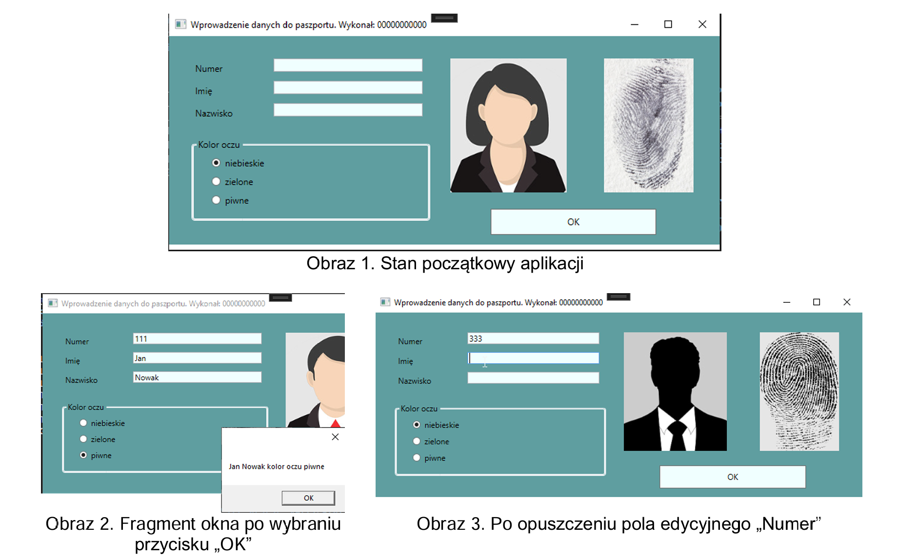

# Sprawdzian
## Podstawy MAUI (A)
Aplikacja desktopowa do wprowadzania danych paszportowych.

## Opis zadania
Wykonaj aplikację desktopową do wprowadzania danych paszportowych. Do wykonania zadania wykorzystaj znajdujące się materiały w katalogu `files`.

Na **obrazie 1** przedstawiono ideę aplikacji desktopowej. Interfejs wykonany w technologii **.NET MAUI może nieznacznie się różnić**.

## Opis wyglądu aplikacji
- Okno o nazwie „Wprowadzenie danych do paszportu. Wykonał: ” następnie wstawione imię i nazwisko.
- Kontrolki rozmieszczone zgodnie z obrazem 1:
    - Pole edycyjne poprzedzone etykietą o treści *„Numer”*.
    - Pole edycyjne poprzedzone etykietą o treści *„Imię”*.
    - Pole edycyjne poprzedzone etykietą o treści *„Nazwisko”*.
    - Grupa „Kolor oczu” zawierająca trzy pola wyboru: *„niebieskie”*, *„zielone”*, *„piwne”*. Pierwsze pole jest domyślnie zaznaczone.
    - W grupie może być jednocześnie zaznaczone jedno pole.
    - Przycisk o treści *„OK”*.
- Dwa obrazy: `000-zdjecie.jpg` oraz `000-odcisk.jpg`. Obrazy mają tę samą wysokość. W aplikacji, której okno przedstawiono na obrazie 1 zastosowano wysokość równą `180`.
- Okno ma tło koloru CadetBlue (`#5F9EA0`).
- Pola edycyjne i przycisk mają tło koloru Azure (`#F0FFFF`).

## Opis działania aplikacji
Aplikacja powinna zachowywać się w ściśle określony sposób.

### Działanie aplikacji po opuszczeniu pola edycyjnego *"Numer"*
- Aktualizowane są oba zdjęcia w oknie. Nazwy plików graficznych są utworzone na podstawie wpisanego numeru do pola edycyjnego *„Numer”*.
- Obraz osoby ma nazwę `<numer>-zdjecie.jpg`, gdzie `<numer>` został pobrany z pola edycyjnego, np. po wpisaniu do pola edycyjnego *„333”* ustawiona nazwa zdjęcia to `333-zdjecie.jpg`.
- Podobnie, obraz odcisku palca ma nazwę `<numer>-odcisk.jpg`, gdzie `<numer>` został pobrany z pola edycyjnego, np. `333-odcisk.jpg` *(Obraz 3)*.
- Do testów aplikacji należy wykorzystać wszystkie obrazy z wypakowanego archiwum. W przypadku wpisania numeru *(np. 444)*, który nie odpowiada żadnemu plikowi graficznemu, obraz nie jest wyświetlany.

### Działanie aplikacji po wciśnięciu przycisku *"OK"*
- Jeżeli dane zostały wprowadzone do wszystkich pól edycyjnych, wyświetlany jest komunikat zgodny z *obrazem 2*, o treści: „`<imie>` `<nazwisko>` kolor oczu `<kolor>`", gdzie pola w nawiasach `<>` zostały pobrane z kontrolek.
- Jeżeli nie wpisano imienia lub nazwiska, wyświetlany jest komunikat *„Wprowadź dane”*.

Aplikacja powinna być **zapisana czytelnie**, z zasadami **czystego formatowania kodu**, należy stosować **znaczące nazwy zmiennych i funkcji**.

Kod aplikacji spakuj do archiwum zip oraz podpisz je imieniem i nazwiskiem - **przed spakowaniem** zamknij Visual Studio oraz usuń katalogi `bin` oraz `obj`.

Wykonaj zrzuty ekranu **dokumentujące uruchomienie aplikacji** utworzonych podczas sprawdzianu. Zrzuty powinny obejmować cały obszar ekranu monitora z widocznym paskiem zadań. Jeżeli aplikacja uruchamia się, na zrzucie należy umieścić okno z wynikiem działania programu oraz otwarte środowisko programistyczne z projektem lub okno terminala z kompilacją projektu. Jeżeli aplikacja nie uruchamia się z powodu błędów kompilacji, należy na zrzucie umieścić okno ze spisem błędów i widocznym otwartym środowiskiem programistycznym. Należy wykonać tyle zrzutów, ile interakcji podejmuje aplikacja *(np. stan początkowy, po wpisaniu numeru i opuszczeniu kontrolki, po wciśnięciu przycisku OK itd.)* Zrzuty ekranu muszą dokumentować interakcje, może ich być dowolna liczba o nazwach `desktop1`, `desktop2`, ...

W edytorze tekstu pakietu biurowego utwórz plik z dokumentacją i nazwij go `sprawdzian`. Dokument powinien zawierać podpisane zrzuty ekranu. Zrzuty ekranu umieść w katalogu `dokumentacja`.

**UWAGA:** Wszystkie pliki i katalogi, które utworzyłeś, umieść w pliku zip ze swoim imieniem i nazwiskiem.

## Kryteria oceniania
Ocenie będą podlegać 3 rezultaty:
- implementacja, kompilacja, uruchomienie programu,
- aplikacja desktopowa,
- dokumentacja aplikacji.