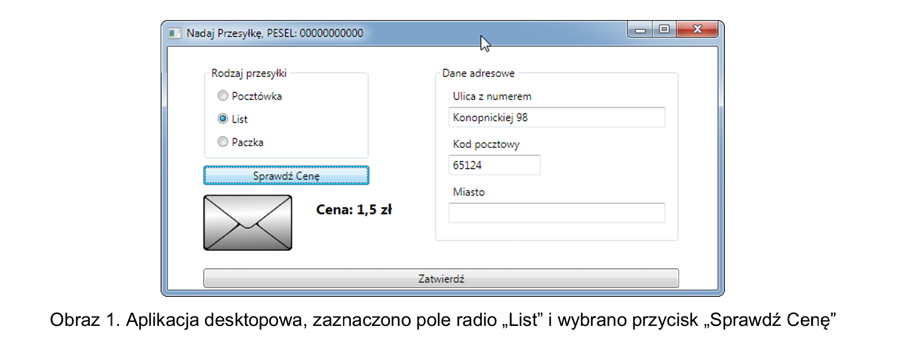

# Sprawdzian
## Podstawy MAUI (B)
Aplikacja desktopowa do obsługi poczty.

## Opis zadania
Wykonaj aplikację desktopową będącą fragmentem aplikacji do obsługi poczty. Do wykonania zadania wykorzystaj znajdujące się materiały w katalogu `files`.

Na **obrazie 1** przedstawiono ideę aplikacji desktopowej. Interfejs wykonany w technologii **.NET MAUI może nieznacznie się różnić**.

## Opis wyglądu aplikacji
- Okno dialogowe o nazwie „Nadaj Przesyłkę” i szerokości dopasowanej do kontrolek wewnątrz. W nazwie okna należy wstawić także swoje imię i nazwisko.
- Okno zawiera kontrolki rozmieszczone zgodnie z obrazem 1. Są to:
    - grupa pól radio: Pocztówka, List, Paczka; pola są zgrupowane w dowolny dostępny element grupujący *(np. GroupBox)*, w stanie początkowym zaznaczone jest pole Pocztówka.
    - trzy pola edycyjne poprzedzone etykietami o treści *„Ulica z numerem”*, *„Kod pocztowy”*, *„Miasto”*; zgrupowane w dowolny dostępny element grupujący.
    - przycisk o treści *„Sprawdź Cenę”*.
    - obraz w stanie początkowym wyświetlający obraz `pocztowka.png`.
    - etykieta o treści *„Cena: ”*, o cechach: napis pogrubiony i czcionka widocznie większa względem pozostałych napisów.
    - przycisk o treści: *„Zatwierdź*.

## Opis działania aplikacji
- Pola radio działają w grupie, jednocześnie może być wybrane tylko jedno pole,
- po wybraniu przycisku *„Sprawdź cenę”* aplikacja sprawdza, które pole radio jest zaznaczone i zależnie od wyboru wyświetla odpowiedni dla pola obraz oraz cenę, odpowiednio:
    - pole radio Pocztówka: obraz `pocztowka.png`, *„Cena: 1 zł”*,
    - pole radio List: obraz `list.png`, *„Cena: 1,5 zł”*,
    - pole radio Paczka: obraz `paczka.png`, *„Cena: 10 zł”*,
- po wybraniu przycisku „Zatwierdź” jest walidowane pole kodu pocztowego oraz wyświetlany komunikat. Dla uproszczenia zadania należy przyjąć, że kod składa się tylko z 5 cyfr (bez znaku `-`),
    - komunikat dla poprawnego kodu pocztowego: „Dane przesyłki zostały wprowadzone”,
    - komunikat, gdy jest mniej lub więcej niż 5 znaków: „Nieprawidłowa liczba cyfr w kodzie pocztowym”,
    - komunikat, gdy przynajmniej jeden znak nie jest cyfrą: „Kod pocztowy powinien się składać z samych cyfr”.

## Założenia aplikacji
- Pliki obrazów zapisane w zasobach aplikacji.
- Aplikacja obsługuje dwa zdarzenia: kliknięcie dla każdego z przycisków.
- Po wybraniu przycisku *Zatwierdź* aplikacja jedynie wyświetla komunikat. Nie jest wymagane, aby dane z okna zostały zapisane do struktury w programie.

Aplikacja powinna być **zapisana czytelnie**, z zasadami **czystego formatowania kodu**, należy stosować **znaczące nazwy zmiennych i funkcji**.

Kod aplikacji spakuj do archiwum zip oraz podpisz je imieniem i nazwiskiem - **przed spakowaniem** zamknij Visual Studio oraz usuń katalogi `bin` oraz `obj`.

Wykonaj zrzuty ekranu **dokumentujące uruchomienie aplikacji** utworzonych podczas sprawdzianu. Zrzuty powinny obejmować cały obszar ekranu monitora z widocznym paskiem zadań. Jeżeli aplikacja uruchamia się, na zrzucie należy umieścić okno z wynikiem działania programu oraz otwarte środowisko programistyczne z projektem lub okno terminala z kompilacją projektu. Jeżeli aplikacja nie uruchamia się z powodu błędów kompilacji, należy na zrzucie umieścić okno ze spisem błędów i widocznym otwartym środowiskiem programistycznym. Należy wykonać tyle zrzutów, ile interakcji podejmuje aplikacja *(np. stan początkowy, po wpisaniu numeru i opuszczeniu kontrolki, po wciśnięciu przycisku Zatwierdź itd.)* Zrzuty ekranu muszą dokumentować interakcje, może ich być dowolna liczba o nazwach `desktop1`, `desktop2`, ...

W edytorze tekstu pakietu biurowego utwórz plik z dokumentacją i nazwij go `sprawdzian`. Dokument powinien zawierać podpisane zrzuty ekranu. Zrzuty ekranu umieść w katalogu `dokumentacja`.

**UWAGA:** Wszystkie pliki i katalogi, które utworzyłeś, umieść w pliku zip ze swoim imieniem i nazwiskiem.

## Kryteria oceniania
Ocenie będą podlegać 3 rezultaty:
- implementacja, kompilacja, uruchomienie programu,
- aplikacja desktopowa,
- dokumentacja aplikacji.