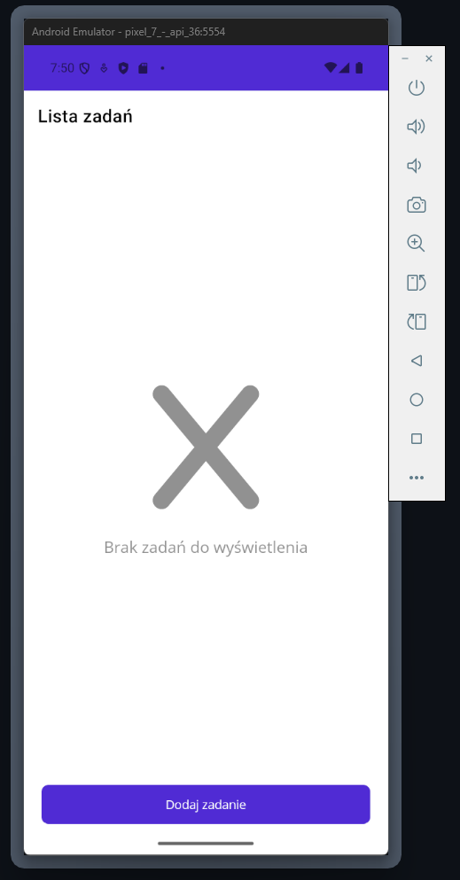
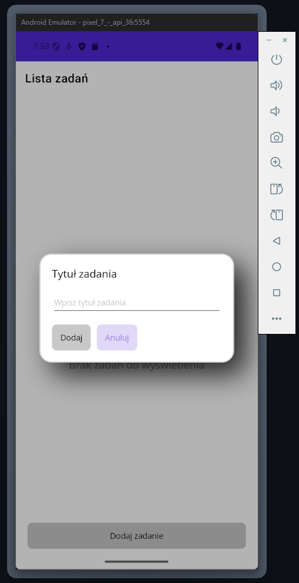
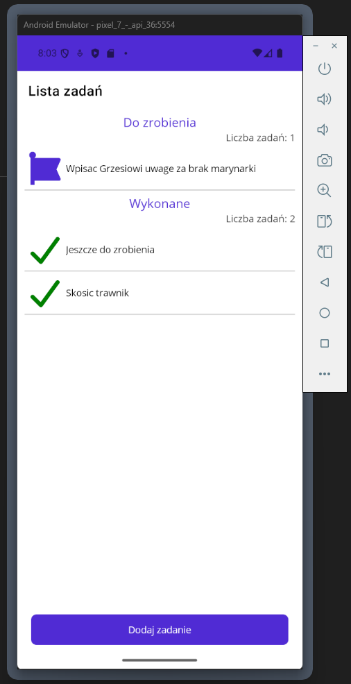
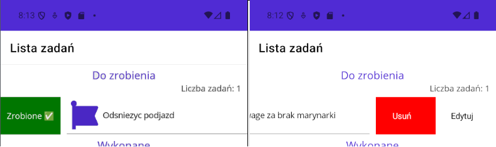
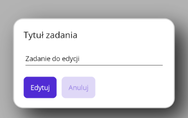

# Task 10 - Aplikacja ToDo
Twoim zadaniem jest przygotowanie prostej **aplikacji mobilnej** do zarządzania zadaniami, korzystając z wzorca MVVM.

## Wymagania
Stwórz prostą aplikację "ToDo", która pozwala użytkownikowi na:
- Dodawanie nowych zadań
- Wyświetlanie listy zadań
- Oznaczanie zadań jako ukończone
- Usuwanie zadań
- Edycję istniejących zadań *(może działać tylko do aktywnych zadań)*
- Wykorzystaj wzorzec MVVM do organizacji kodu.

**Jeżeli aplikacja nie będzie poprawnie korzystać z MVVM, zadanie nie zostanie zaliczone.**

## Krok po kroku
Spróbujmy stworzyć aplikację prostą, ale funkcjonalną i dopracowaną. Celem zapewnienia odpowiedniego poziomu UX, zaimplementujemy następujące funkcjonalności:

### Pusty widok


Jeżeli aktualnie nie ma żadnych zadań do zrobienia, ani zadań już wykonanych, aplikacja powinna wyświetlać użytkownikowi stosowny komunikat o braku zadań.

### Formularz rejestracji zadania


Otrzymujesz pełną dowolność w kwestii implementacji rozwiązania służącego do rejestrowania nowych zadań:
 - możesz skorzystać w tym celu z osobnej strony z prostym formularzem,
 - możesz zdecydować się na wyświetlenie formularza w oknie popup.

**Pamiętaj o dobrych praktykach**, takich jak uniemożliwienie dodania nowego zadania, kiedy nie podaliśmy jego tytułu.

Jeżeli chcesz skorzystać z okna popup, wystarczy, że skorzystasz z biblioteki `CommunityToolkit.Maui`, która dostarcza taką funkcjonalność. Wskazówki implementacji okien popup znajdziesz w [dokumentacji dostarczanej przez Microsoft](https://learn.microsoft.com/en-us/dotnet/communitytoolkit/maui/views/popup).

### Lista zadań


Projektując wygląd listy z zadaniami, zadbaj przyjazny UX:
 - wykorzystaj ikony, aby urozmaicić UI,
 - podziel zadania na kategorie - **do zrobienia** i **zrobione**,
 - zadbaj o odstępy, aby:
    - użytkownik widział separatory między zadaniami na liście,
    - elementy listy nie przylegały zbyt mocno do krawędzi ekranu,
 - wyświetl informację, ile zadań oczekuje na realizację, a ile zostało już wykonanych
 - zadbaj o schludną kolorystkę aplikacji, korzystaj z zdefiniowanych kolorów lub zdefiniuj własne w `Colors.xaml`.

Ikony, które wykorzystasz przy tworzeniu aplikacji, możesz wziąć [przykładowo stąd](https://fontawesome.com/start). Idealnie, jeżeli wykorzystasz **wektorowe** wersje ikon.

Jako, że chcemy wykorzystać całą dostępną powierzchnię wyświetlacza, skorzystaj z `SwipeView` celem obsługi akcji związanych z zadaniami.


Poszczególne akcje, powinny być wykonywane następująco:
 - Przy oznaczaniu zadania jako wykonane, chcemy aby wystarczyło jedynie przeciągnąć palcem po danym zadaniu.
 - Przy edycji bądź usuwaniu zadania, chcemy dać użytkownikowi możliwość wyboru jednej z możliwości.
 - Masz dowolność przy obsłudze akcji, dla już wykonanego zadania.

### Edycja zadania


Jeżeli użytkownik edytuje zadanie, zadbaj o poprawną implementację tego mechanizmu.
 - Używaj **dokładnie tego samego okna / strony**, zarówno do dodawania nowego zadania jak i edycji istniejącego.
 - Jeżeli użytkownik edytuje zadanie, w polu tekstowym powinien **zastać aktualny tytuł zadania**.
 - Przycisk służący do zatwierdzania powinien wyświetlać inny komunikat, w zależności od akcji - `Dodaj` lub `Edytuj`.

## Wskazówki
Podczas pracy nad aplikacją, zwróć uwagę na następujące kwestie:
 - Czy widok pustej listy jest również wyświetlany, kiedy usuniemy wszystkie zadania.
 - Czy lista z zadaniami aktualizuje się samoczynnie.
 - Czy zadanie na liście, po edycji, automatycznia się zaktualizuje.

Pamiętaj, że poprawne zastosowanie MVVM wymaga oddzielenia **logiki biznesowej** od **warstwy prezentacji**. Zadanie do wykonania, będzie częścią modelu. Poprawne reagowanie na aktualizacje zadań, wymagają jednak zastosowania `[ObservableProperty]`, które nie powinno znajdować się w klasie modelu.

Możesz mieć problem z poprawną reakcją `CollectionView` na usunięcie z niej wszystkich elementów. Wtedy możliwe, że będzie trzeba ręcznie wymusić aktualizację widoku. Możesz w tym celu skorzystać z metody pomocniczej, znajdującej się w ViewModelu.

```csharp
private void ResetCollectionView()
{
    if (ToDoGroups.Count == 0)
    {
        ToDoGroups = new ObservableCollection<ToDoGroup>(ToDoGroups.OrderByDescending(g => g.Done));
    }
}
```

Aplikacja na tym etapie **nie musi zapisywać wprowadzonych danych**. Zadanie przewiduje, że po każdym restarcie aplikacji, nie będziemy mieli dostępu do zadań utworzonych wcześniej.

**Powodzenia! 💪**