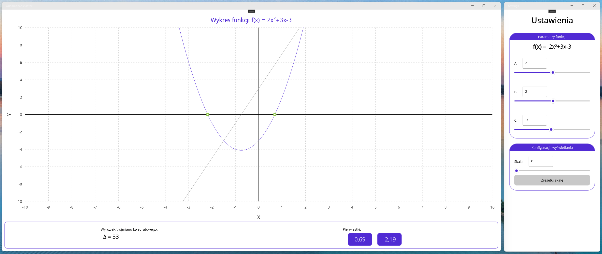

# Task 17 - Kalkulator funkcji kwadratowej
Prosty kalkulator pozwalający na rysowanie wykresu funkcji kwadratowej, z wykorzystaniem sliderów - *specjalna dedykacja dla Karola*.


## Wymagania
Twoja aplikacja powinna spełniać następujące kryteria:
 - powinna składać się z dwóch okien - jedno do sterowania, drugie służące do renderowania wykresu funkcji oraz wyświetlania takich charakterystyk jak:
    - wyróżnik trójmianu kwadratowego (Δ),
    - punkty zerowe funkcji - *również w przypadku, kiedy `Δ < 0`*,
 - wykres powinien:
    - w czasie rzeczywistym reagować na zmianę wartości parametrów funkcji:
        - po wprowadzeniu wartości w odpowiednie `<Entry />`,
        - poprzez zmianę wartości `<Slider />`
    - poprawnie wyświetlać parabolę,
    - poprawnie wyświetlać pochodną funkcji,
    - poprawnie wyświetlać miejsca zerowe funkcji, jeżeli należą do liczb rzeczywistych,
    - wyświetlać miejsca zerowe funkcji, o ile znajdują się na płaszczyźnie liczb rzeczywistych *(bez pierwiastków zespolonych)*,
    - umożliwiać użytkownikowi zmianę skali - *zarówno przez interakcję myszką na wykresie, jak i przez specjalny slider*,
    - poprawnie wyświetlać osie na wykresie,
    - posiadać czytelną siatkę wartości na osi Y i X,
    - posiadać tytuł, który wyświetla równanie funkcji,
    - posiadać czytelną siatkę, ułatwiającą czytanie wykresu,
    - poprawnie podpisywać osie Y i X.

**Dla uproszczenia** aplikacja nie musi pokazywać pierwiastków zespolonych na wykresie, ani obsługiwać funkcji trygonometrycznych w zapisie funkcji. Wystarczy obsługa najprostszych funkcji kwadratowych `f(x) = ax^2 + bx + c`, gdzie każdy z parametrów jest **liczbą całkowitą**.

## Krok po kroku
Poniżej znajdziesz kroki, które należy wykonać aby uzyskać pożądany efekt.

### Biblioteka do rysowania wykresów
Do rysowania wykresów użyj biblioteki `LiveChartsCore.SkiaSharpView.Maui`, którą możesz zainstalować jako pakiet NuGet. Po jej zainstalowaniu, niezbędne będzie jej zarejestrowanie w pliku `MauiProgram.cs`.

```csharp
var builder = MauiApp.CreateBuilder();
builder.UseMauiApp<App>().ConfigureFonts(fonts =>
{
    fonts.AddFont("OpenSans-Regular.ttf", "OpenSansRegular");
    fonts.AddFont("OpenSans-Semibold.ttf", "OpenSansSemibold");
}).UseMauiCommunityToolkit()
.UseSkiaSharp().UseLiveCharts(); // <-- fragment, który należy dodać
```

`SkiaSharp` to popularna biblioteka służąca do renderowania grafiki na platformie .NET, z której korzysta właśnie `LiveCharts2`.

**Dokumentację biblioteki znajdziesz tutaj:** [Dokumentacja](https://livecharts.dev)

### Matematyka
Dla uproszczenia będziemy posługiwali się zapisem dziesiętnym (*czyli bez pierwiastków, ułamków - po prostu ostateczny wynik jako liczba dziesiętna*). Niemniej warto przypomnieć sobie wzory, z których będziesz korzystał.

**Równanie kwadratowe:**

$$
ax^2 + bx + c = 0
$$

gdzie:

$$
a \neq 0
$$

**Wyróżnik trójmianu kwadratowego (Δ):**

$$
\Delta = b^2 - 4ac
$$

**Pierwiastki rzeczywiste:**

Gdy $\Delta > 0$

$$
x_1 = \frac{-b - \sqrt{\Delta}}{2a}
$$

$$
x_2 = \frac{-b + \sqrt{\Delta}}{2a}
$$

Gdy $\Delta = 0$

$$
x_0 = \frac{-b}{2a}
$$

**Pierwiastki zespolone:**

Gdy $\Delta < 0$

$$
\sqrt{\Delta} = i\sqrt{-\Delta}
$$

gdzie:

$$
i^2 = -1
$$

wtedy:

$$
x_1 = \frac{-b - i\sqrt{-\Delta}}{2a}
$$

$$
x_2 = \frac{-b + i\sqrt{-\Delta}}{2a}
$$

Dla rzeczywistych współczynników $a$, $b$ i $c$ pierwiastki zespolone są liczbami sprzężonymi:

Jeżeli:

$$
x_1 = p + qi
$$

to:

$$
x_2 = p - qi
$$

**Dla uproszczenia** nie będziesz musiał rysować wykresu pierwiastków zespolonych, wystarczy ich poprawne wyświetlenie (*narysowanie wymagałoby stworzenie drugiego wykresu z osiami Re i Im*).

> **Podpowiedź**
>
> Dobrą praktyką będzie stworzenie osobnej klasy statycznej z metodami obliczeniowymi - dzięki temu, nie będziesz musiał powielać tego samego kodu w kilku miejscach.

Wyniki mogą sięgać wielu miejsc po przecinku, dla uproszczenia możemy je **zaokrąglać do dwóch miejsc dziesiętnych**.

### Obsługa dwóch okien w aplikacji
Rozbicie aplikacji na dwa współpracujące ze sobą okna jest **bardzo proste**, wystarczy w odpowiednim miejscu - *np. w code-behind strony głównej* umieścić następujący fragment kodu:

```csharp
 public MainPage(MainViewModel vm)
 {
     InitializeComponent();
     BindingContext = vm;

     // Tworzenie okna z ustawieniami
     var settingsWindow = new Window(new SettingsPage(vm)) // <-- SettingsPage to po prostu samodzielna strona XAML
     {
         Title = "Settings",
         Width = 400,
         Height = 550
     };

     Application.Current.OpenWindow(settingsWindow);
 }
```

**Zauważ**, że do nowego okna wysyłany jest ten sam ViewModel, z którego korzysta główne okno aplikacji. Dzięki takiemu zabiegowi poszczególne okna będą reagowały na zmianę wartości właściwości w ViewModelu, niezależnie w którym oknie zaszła zmiana.

## Wskazówki
Poniżej znajdziesz kilka wskazówek, które pomogą Ci w realizacji projektu.

### Rysowanie osi X i Y
Biblioteka `LiveCharts2` nie jest przystosowana do rysowania wykresów funkcji w znanym nam układzie kartezjańskim, w związku z tym osie X i Y będzie trzeba narysować *"na patencie"*, przy pomocy sekcji:

```xml
<lvc:CartesianChart.Sections>
    <lvc:SectionsCollection>
        <lvc:XamlRectangularSection 
            Xi="-0.00001"
            Xj="0.00001"
            Stroke="{Binding QuadraticPlot.AXisStroke}"
            Fill="{x:Null}"/>
        <lvc:XamlRectangularSection 
            Yi="-0.00001"
            Yj="0.00001"
            Stroke="{Binding QuadraticPlot.AXisStroke}"
            Fill="{x:Null}"/>
    </lvc:SectionsCollection>
</lvc:CartesianChart.Sections>
```

Zauważ, że `Xi`, `Xj` oraz `Yi`, `Yj` mają przypisane bardzo małe wartości, są one tak małe aby osie X i Y nie były zbyt szerokie. W przypadku ustawienia jako parametr zwykłego `0`, sekcja wyrenderuje się na całej szerokości lub wysokości wykresu.

### Adapter do obsługi wykresu
Przy korzystaniu z zewnętrznych bibliotek, często dobrym pomysłem jest skorzystanie z wzorca **adapterów**, co pozwoli nam w znacznym stopniu uporządkować główny ViewModel, i przenieść logikę odpowiedzialną wyłącznie za wykres do innej klasy.

```csharp
public partial class MainViewModel : ObservableObject // <-- Główny ViewModel
{
    public QuadraticPlotDriver QuadraticPlot { get; } // <-- Adapter do obsługi wykresu

    public MainViewModel()
    {
        QuadraticPlot = new QuadraticPlotDriver(0.1, -10, 10);
    }

    // [...]
}
```

Sam adapter też musi dziedziczyć po `ObservableObject`, aby działał binding z wykresem *(przykład bindingu znajdziesz w poprzednim fragmencie kodu XAML)*:

```csharp
public partial class QuadraticPlotDriver : ObservableObject
{
    public QuadraticPlotDriver(double resolution, double min, double max)
    {
        var pointsCount = (int)((max - min) / resolution) + 1;
        Roots = [new(), new()];
        QuadraticPoints = new ObservablePoint[pointsCount];
        DerivativePoints = new ObservablePoint[pointsCount];

        for (var i = 0; i < QuadraticPoints.Length; i++)
        {
            QuadraticPoints[i] = new(i * resolution + min, null);
            DerivativePoints[i] = new(i * resolution + min, null);
        }

        // Inicjalizacja osi X i Y dla wykresu funkcji kwadratowej
        QuadraticXAxis = new Axis()
        {
            MaxLimit = 10,
            MinLimit = -10,
            MinStep = 1,
            Name = "X",
            NamePaint = new SolidColorPaint(SKColor.Parse("#000000")),
            SeparatorsPaint = new SolidColorPaint(SKColor.Parse("#C8C8C8"))
            {
                StrokeThickness = 1,
                PathEffect = new DashEffect(new float[] { 5, 5 })
            }
        };

        // [...]

        // Obsługa zoomu na wykresie
        QuadraticYAxis.PropertyChanged += AXisPropertyChanged;
        QuadraticXAxis.PropertyChanged += AXisPropertyChanged;

        // [...]

        YAxes = [QuadraticYAxis];
        XAxes = [QuadraticXAxis];
    }

    // [...]
}
```

### Obsługa zoomowania
Aby możliwe było jednoczesne zoomowanie wykresu zarówno przez jego kontrolkę, jak i osobny slider. Dobrym pomysłem będzie zablokowanie slidera, kiedy użytkownik przeskaluje wykres przy użyciu gestów myszy na kontrolce z wykresem. Możemy to łatwo zrobić przez zdarzenie `PropertyChanged` w klasie `Axis`:

```csharp
[ObservableProperty]
[NotifyPropertyChangedFor(nameof(TextScale))]
[NotifyPropertyChangedFor(nameof(SliderScale))]
[NotifyPropertyChangedFor(nameof(IsZoomingEnabled))]
private int _scale;

[ObservableProperty]
private bool _isZoomingEnabled = true;

public string TextScale
{
    get => Scale.ToString();
    set
    {
        if (Int32.TryParse(value, out var numericValue))
        {
            Scale = numericValue;
        }
    }
}

public double SliderScale
{
    get => Scale;
    set => Scale = Convert.ToInt32(value);
}

partial void OnScaleChanged(int value)
{
    XAxes[0].MaxLimit = value;
    XAxes[0].MinLimit = -value;

    YAxes[0].MaxLimit = value;
    YAxes[0].MinLimit = -value;
}

private void AXisPropertyChanged(object? sender, PropertyChangedEventArgs e)
{
    // Blokowanie skalowania
    if (e.PropertyName == nameof(Axis.MaxLimit) || e.PropertyName == nameof(Axis.MinLimit))
    {
        if ((XAxes[0].MinLimit != -Scale || XAxes[0].MaxLimit != Scale || YAxes[0].MinLimit != -Scale || YAxes[0].MaxLimit != Scale) && IsZoomingEnabled)
        {
            IsZoomingEnabled = false;
        }
    }
}

[RelayCommand]
private void ResetScale()
{
    Scale = 10;
}
```

**Zwróć uwagę**, że w instrukcji warunkowej jest również blokada na `IsZoomingEnabled`. Dzięki temu zapobiegamy cofaniu zmian w interfejsie użytkownika (*bez tego wykres wracałby do poprzedniej skali*) poprzez ograniczenie aktualizacji wychodzących z sterownika do UI.

### Model do obsługi pierwiastków funkcji
Jako, że nasza aplikacja potrafi obliczyć również pierwiastki zespolone dla funkcji kwadratowej, dobrym pomysłem będzie przygotowanie klasy (*model*) do ich przechowywania:

```csharp
public class FunctionRoot
{
    public FunctionRoot(double re, double im = Double.NaN)
    {
        Realis = re;
        Imaginalis = im;
    }

    public double Realis { get; set; }

    public double Imaginalis { get; set; }

    public override string ToString()
    {
        if (Double.IsNaN(Imaginalis)) // <-- Brak części urojonej pierwiastka
        {
            return Math.Round(Realis, 2).ToString(); // <-- Wyświetlanie pierwiastka rzeczywistego
        }

        // Kod wyświatlający pierwiastek zespolony w formacie a + bi lub a - bi
        // [...]
    }
}
```

Tutaj **pamiętaj o dodaniu zaokrągleń**, w przypadku pierwiastków zespolonych będą one potrzebne zarówno dla części rzeczywistej i urojonej.

### Aktualizacja wykresu funkcji
Dobrym pomysłem będzie stworzenie pojedynczej metody odpowiedzialnej wyłącznie za aktualizację wykresu funkcji. W tym celu najlepiej po prostu aktualizować wartości poszczególnych punktów, wraz ze zmianą parametrów. **Nie twórz za każdym razem nowej kolekcji z punktami!**

```csharp
public void RecalculatePoints(int paramA, int paramB, int paramC, FunctionRoot[] roots)
{
    foreach (var p in QuadraticPoints)
    {
        p.Y = FxCalculator.CalculateFx(paramA, paramB, paramC, p.X.Value);
    }

    // Tutaj obliczamy pochodną
    // [...]

    if (roots.Length > 0)
    {
        // Jeżeli funkcja ma pierwiastki rzeczywiste lub zespolone, możemy obliczyć je tutaj
        // [...]
    }
}
```

**Zauważ, że** w tej metodzie zakładamy, że funkcja może nie mieć pierwiastków. Nasza aplikacja służy głównie do rysowania wykresu funkcji kwadratowej, w przypadku gdy `a = 0`, nie będzie możliwe obliczenie punktu przecięcia funkcji z osią X standardowymi wzorami - **potraktuj to jako uproszczenie**.

## Kryteria oceny
Masz wolną rękę w stworzeniu designu dla tej aplikacji - nie musi być on identyczny jak na przykładowym obrazku, **ale powinien być ładny, schludny, spójny i czytelny**.

### Na ocenę dopuszczającą
Aby uzyskać ocenę dopuszczającą:
 - aplikacja musi być w pełni responsywna - **natychmiastowo reagować na zmianę parametrów funkcji**,
 - posiadać dwa okna - jedno z wykresem, jedno umożliwiające sterowanie parametrami funkcji,
 - obsługiwać wprowadzanie danych zarówno przez `<Entry />` jak i `<Slider />`,
 - poprawnie rysować wykres funkcji kwadratowej,
 - poprawnie rysować wyśrodkowany układ kartezjański - z punktem (0, 0) po środku,
 - posiadać czytelny wykres funkcji,
 - poprawnie liczyć:
    - wyróżnik trójmianu kwadratowego,
    - pierwiastki rzeczywiste,
    - pierwiastki urojone,
 - poprawnie rysować wykres pochodnej, oznaczonej innym kolorem niż główna funkcja.

### Na ocenę bardzo dobrą
Celem uzyskania oceny bardzo dobrej, aplikacja musi poprawnie implementować wszystkie funkcjonalności opisane na początku instrukcji.

### Na ocenę celującą
Po zamknięciu któregokolwiek okna aplikacji, cała aplikacja powinna zostać zatrzymana.

#### Wskazówka
Wystarczy nadpisać `override` odpowiednią metodę w code-behind każdej ze stron, i odwołać się do odpowiedniej metody. Znajdziesz ją, w tym samym miejscu, w którym jest metoda `OpenWindow()`.