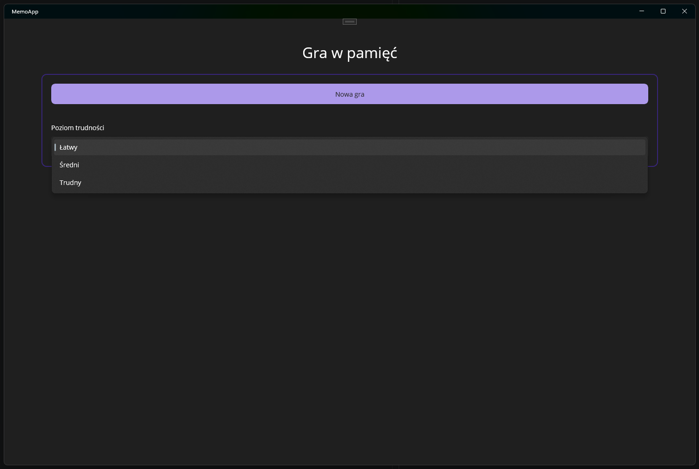
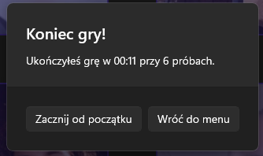

# Task 16 - Gra w pamięć
Prosta gra w pamięć jako aplikacja desktopowa w .NET MAUI z wykorzystaniem wzorca MVVM.


## Wymagania
Twoja aplikacja powinna posiadać następujące możliwości:
 - wybór poziomu trudności:
    - łatwy - 4 pary kart,
    - średni - 6 par kart,
    - trudny - 8 par kart,
 - liczyć czas gry oraz łączną liczbę prób w danej rozgrywce (*jedna próba to odkrycie pary kart - nieważne czy trafione, czy nie*),
 - karty powinny być losowo rozkładane na planszy dla każdej kolejnej gry,
 - użytkownik nie może mieć możliwości odkrycia więcej niż dwóch kart na raz,
 - po odkryciu pary kart, które do siebie nie pasują, program powinien kazać użytkownikowi czekać (*np. jedną lub dwie sekundy*), zanim będzie mógł wykonać kolejny ruch - **blokada nie może spowodować zamrożenia UI, niezbędna jest prawidłowa obsługa operacji asynchronicznych / wielowątkowych**,
 - po zakończonej grze użytkownik otrzymuje informację o czasie rozgrywki oraz liczbie prób.

## Wskazówki
Poniżej znajdziesz drobne podpowiedzi, które pomogą Ci przejść przez realizację zadania.


### Wyświetlanie kart
Do wyświetlenia pojedynczej karty możemy skorzystać z kontrolki `<ImageButton />` - jest to hybryda `<Image />` oraz `<Button />`, która idealnie sprawdzi się do tego zadania. Domyślnie może wyświetlać wybrany obrazek oznaczający nieodkrytą kartę oraz reagować na odkrycie karty wyświetlając obrazek, który jest za nią ukryty, za pośrednictwem aktualizacji ViewModelu - wystarczy zbindować właściwość właściwość `Source` oraz odpowiednio ją obsłużyć. Do blokowania dopasowanych par można użyć właściwości `IsEnabled` oraz ustawić własny `BackgroundColor` dla kontrolki - wtedy po jej wyłączeniu uzyskamy efekt zdjęcia z lekko widocznym kolorem tła, nad zdjęciem.

### Wysyłanie informacji o poziomie trudności do strony gry
Stronę z grą możemy wyrenderować dopiero po otrzymaniu poziomu trudności z poprzedniej strony - tutaj pojawia się problem... w którym momencie wiemy, że już mamy tę informację? Celem obsługi zmiany poziomu trudności, jeżeli nasza właściwość w ViewModelu nazywa się `Level`, **wystarczy stworzyć metodę cząstkową**, będącą rozszerzeniem metody wygenerowanej przez `CommunityToolkit.Mvvm`:
```csharp
partial void OnLevelChanged(DifficultyLevel? value)
{
    if (value.HasValue && Cards.Count == 0)
    {
        // Metoda rozpoczynająca inicjalizację planszy
        InitializeCards(value.Value);
    }
}
```

Sprawą **oczywistą** jest to, że poziom trudności powinien być typem wyliczeniowym - `enum`. Na powyższym przykładzie jest on `nullable` aby uniknąć sytuacji, w której renderujemy planszę na podstawie wartości domyślnej danego typu.

### Obsługa timera
W .NET istnieje wiele różnych timerów, z których można skorzystać. Polecam z skorzystania z asynchronicznego `PeriodicTimer`, który jest niezależny od platformy oraz pozwala na wykonywanie operacji asynchronicznych w dokładnych odstępach czasu. Jego obsługa jest bardzo prosta:
```csharp
private PeriodicTimer _timer;

private void SomeInitializeMethod()
{
    // [...]

    _timer = new PeriodicTimer(TimeSpan.FromSeconds(1));
    _timerTask = TimerLoop(); //Pętla jest lekka, możemy uruchomić w tym samym wątku
}

private async Task TimerLoop()
{
    while (!_finished) // Nigdy nie robimy while (true) !!!
    {
        await _timer.WaitForNextTickAsync();
        if (!_finished)
        {
            Elapsed = DateTime.Now - _startTime; // Liczymy ile upłynęło czasu od startu gry
        }
    }
}
```

Jeżeli operacja w pętli byłaby obliczeniowo ciężka, moglibyśmy rozważyć przeniesienie jej do osobnoge wątku - niezależnego od UI.

### Oczekiwanie po odkryciu niepasujących kart
Zgodnie z założeniami zadania, w przypadku odkryciu pary kart, które do siebie nie pasują, program powinien użytkownikowi narzucić krótki czas oczekiwania, zanim będzie mógł on zrobić kolejny ruch - w tym, żeby miał czas zapamiętać karty ukryte na danych pozycjach.

Aby uniknąć sytuacji, w której UI zostaje zamrożone podczas oczekiwania na zakończenie odliczania czasu, wystarczy odpowiednio sparametryzować atrybut `[RelayCommand]`:
```csharp
[RelayCommand(CanExecute = nameof(CanBeSelected), AllowConcurrentExecutions = true)]
private async Task SelectAsync()
{
    if (!Matched && !Selected && CanBeSelected())
    {
        Selected = true;
        await _vm.CardSelectedAsync(this);
    }
}
```

Chodzi o właściwość `AllowConcurrentExecutions = true`, która jest opisana w dokumentacji w kodzie:
```XML
<summary>
    Gets or sets a value indicating whether or not to allow concurrent executions for an asynchronous command.
    <para>
        When set for an attribute used on a method that would result in an <see cref="AsyncRelayCommand"/> or an
        <see cref="AsyncRelayCommand{T}"/> property to be generated, this will modify the behavior of these commands
        when an execution is invoked while a previous one is still running. It is the same as creating an instance of
        these command types with a constructor such as <see cref="AsyncRelayCommand(Func{System.Threading.Tasks.Task}, AsyncRelayCommandOptions)"/>
        and using the <see cref="AsyncRelayCommandOptions.AllowConcurrentExecutions"/> value.
    </para>
</summary>
<remarks>Using this property is not valid if the target command doesn't map to an asynchronous command.</remarks>
```

Dzięki odpowiedniemu skonfigurowaniu tej właściwości nie ma ryzyka, że aktualizacja UI nie zdąży się wykonać przed rozpoczęciem oczekiwania - ponieważ będą to operacje równoległe względem siebie.

### Koniec gry
Po zakończonej rozgrywce program powinien wyświetlić komunikat z informacją ile czasu zajęła nam rozgrywka oraz ile prób było nam potrzebnych do jej ukończenia.



Powinniśmy mieć możliwość albo rozpoczęcia rozgrywki od nowa - **z nowym ułożeniem kart i tym samym poziomem trudności** oraz możliwość powrotu do menu głównego (*gdzie użytkownik będzie mógł rozpocząć grę od nowa i wybrać poziom trudności*).

> **Uwaga**
>
> Program nie przewiduje nawigacji poprzez zakładki, więc powrót do menu głównego będzie się sprowadzał do zwykłego **cofnięcia** strony.

## Kryteria oceny
Masz dużą swobodę w sposobie implementacji gry (**poza wymogiem korzystania z wzorca MVVM**), więc kryteria oceny skupiają się wyłącznie na uzyskanym efekcie.

### Na ocenę dopuszczającą
Aby uzyskać ocenę dopuszczającą gra musi być w pełni grywalna, dopuszcza się drobne uchybienia jak nie dokońca działające wybrane mechanizmy - przykładowo utrzymywanie pary niedopasowanych kart na widoku przez określony czas. Muszą poprawnie działać poziomy trudności oraz powrót do menu głównego po ukończeniu rozgrywki.

### Na ocenę celującą
Aplikacja pod każdym względem działa prawidłowo - prawidłowo zostały zaimplementowane wszystkie mechanizmy - oraz posiada schludny i elegancki interfejs użytkownika.